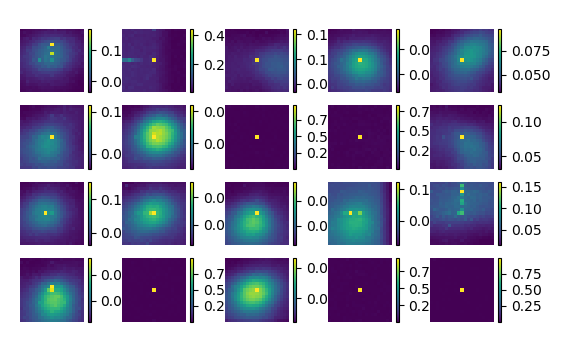
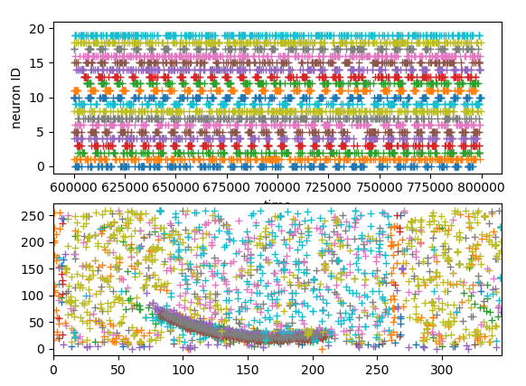
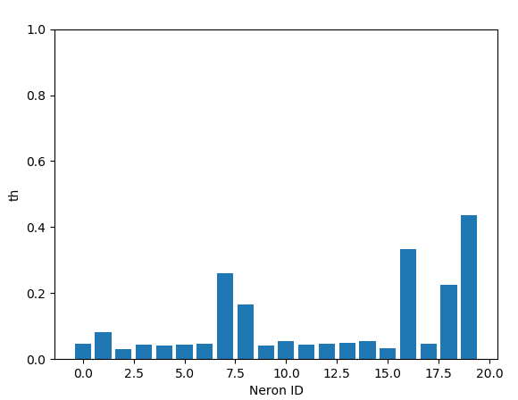

# pyfeast

C++ FEAST filter embedded in Python, including visualization tools. 

Performance (i7-10 neurons-10x10 ROI): 0.5 Mev/s. 

Example:

Given the events stacked in a time image:

The following features can be extracted:

The activations of the neurons can be monitored:

And the thresholds as well:

## Documentation

### C++ File documentation (feast.hpp):

The class FeastLayer propagates events and their spatiotemporal context into a set of FeastNeuron, and apply a FEAST learning rule. 

The events have to contain (x, y, t) peoperties. This implementation is compatible with [Sepia](https://github.com/neuromorphic-paris/sepia)'s dvs events. 

The filter returns neuron activation events: (t, x, y, idneuron). 
All structures have to be packed by the compiler to be interfaced with the Python wrapper. 

Compile and test by running the bash script. 

### Python file documentation (feast.cpp):

The Python wrapper relies on events provided as structured arrays, for example using [event stream](https://github.com/neuromorphicsystems/event_stream). 

An example is provided in test_filter_view.py. 

## Reference

This works tries to implement the algorithm described in :

@Article{s20061600,
AUTHOR = {Afshar, Saeed and Ralph, Nicholas and Xu, Ying and Tapson, Jonathan and Schaik, André van and Cohen, Gregory},
TITLE = {Event-Based Feature Extraction Using Adaptive Selection Thresholds},
JOURNAL = {Sensors},
VOLUME = {20},
YEAR = {2020},
NUMBER = {6},
ARTICLE-NUMBER = {1600},
URL = {https://www.mdpi.com/1424-8220/20/6/1600},
ISSN = {1424-8220},
ABSTRACT = {Unsupervised feature extraction algorithms form one of the most important building blocks in machine learning systems. These algorithms are often adapted to the event-based domain to perform online learning in neuromorphic hardware. However, not designed for the purpose, such algorithms typically require significant simplification during implementation to meet hardware constraints, creating trade offs with performance. Furthermore, conventional feature extraction algorithms are not designed to generate useful intermediary signals which are valuable only in the context of neuromorphic hardware limitations. In this work a novel event-based feature extraction method is proposed that focuses on these issues. The algorithm operates via simple adaptive selection thresholds which allow a simpler implementation of network homeostasis than previous works by trading off a small amount of information loss in the form of missed events that fall outside the selection thresholds. The behavior of the selection thresholds and the output of the network as a whole are shown to provide uniquely useful signals indicating network weight convergence without the need to access network weights. A novel heuristic method for network size selection is proposed which makes use of noise events and their feature representations. The use of selection thresholds is shown to produce network activation patterns that predict classification accuracy allowing rapid evaluation and optimization of system parameters without the need to run back-end classifiers. The feature extraction method is tested on both the N-MNIST (Neuromorphic-MNIST) benchmarking dataset and a dataset of airplanes passing through the field of view. Multiple configurations with different classifiers are tested with the results quantifying the resultant performance gains at each processing stage.},
DOI = {10.3390/s20061600}
}